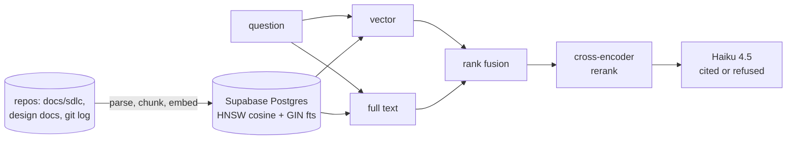

# Studbook

> [!IMPORTANT]
> **This repository is a snapshot, not a live project.** It is a point-in-time export (2026-09-27) of
> a private working repository, published so the work can be read. It has no commit history, is not maintained here,
> and issues or pull requests are not monitored.
>
> Source: Studbook at its last release before the MCP server work (not included: it was not finished). The eval sets are included; the record they were scored against is WorkHorse's own history ([workhorse-snapshot](https://github.com/muhibm1/workhorse-snapshot)). Internal working notes were left out. Connection strings, keys, database project identifiers and
> local paths were never in it or were replaced with placeholders; nothing here connects to a
> live system.

A retrieval-augmented assistant over WorkHorse's own engineering history: gate packets, ADRs,
specs, evidence tables, risk registers, retros and commit messages. Ask why a decision was made
and get an answer that quotes the record, cites the file and section, and says "that's not in the
record" when it isn't.

A studbook is the registry of a horse lineage: the provenance record of the stable.

## Status

All five milestones are done: ingestion, hybrid retrieval, cited generation, a held-out
evaluation, and a service with a page you can use.

**Where it is actually used now is Paddock**, the WorkHorse desktop app, which runs this query
path in its own process — no Python, no service, no port — behind a Studbook tab with a thread and
streaming answers, and re-ingests the record from a button. The two are held to each other by
parity gates rather than by hope: retrieval reproduces this repo's published numbers to four
places, and the ported parser and chunker produce byte-identical ids and hashes
([docs/paddock-gate.md](docs/paddock-gate.md)).

So this repo is now **the reference implementation and the measurement harness**: it owns the
eval, the gold set, the ablations and the gates, and every number either side reports comes from
here. The service and the CLI remain the way to use it without Paddock — and the CLI is still the
fastest way to ask one question.

```bash
.venv/Scripts/python.exe cli.py "why did control state move into the git common dir?"
.venv/Scripts/python.exe -m uvicorn api.main:app --port 8000   # then open http://127.0.0.1:8000
```



Milestone write-ups: [M0 census](docs/m0-census.md),
[M1 store and ingestion](docs/m1-store-and-ingestion.md),
[M2 retrieval and eval](docs/m2-retrieval-and-eval.md),
[M3 generation](docs/m3-generation.md),
[M4 evaluation and scale](docs/m4-evaluation-and-scale.md),
[M5 API and UI](docs/m5-api-and-ui.md), the
[gold-set audit](docs/gold-set-audit.md), the
[retrieval ceiling](docs/retrieval-ceiling.md), the
[Paddock parity gate](docs/paddock-gate.md),
[follow-up retrieval](docs/follow-ups.md),
[cross-doc coverage](docs/cross-doc.md), [the cited refusal](docs/refusal-experiments.md),
[CI](docs/ci.md) and [hosted configuration](docs/hosted-config.md).

### Held-out results (test split, n=20, scored after tuning was frozen)

| Metric | 2026-09-15 | 2026-09-16 | **Current** |
|---|---|---|---|
| Answer correctness (mean, 0-2, LLM-judged) | 1.30 | 1.40 | **1.60** |
| Fully correct (score 2) | 0.65 | 0.65 | **0.75** |
| Faithfulness (no unsupported claims) | 0.95 | 1.00 | **1.00** |
| Citation validity | 1.00 | 1.00 | 0.95 |
| **Unanswerable "trap" questions handled** | **3/3** | **3/3** | **3/3, nothing invented** |
| Over-refused answerable questions | 7 of 17 (41%) | 6 of 17 (35%) | **3 of 17 (18%)** |
| Retrieval recall@5 | 0.6471 | 0.6471 | **0.7059** |

Three scorings of one held-out split, each after a change that made the previous column describe
a system that no longer existed: the prompt revision, then the halved rerank pool. The last one
is the first change here that moved the held-out split with **no question getting worse** — three
better, none worse, two mixed (`eval/compare.py`). Over-refusal, which M4 called the largest lever
on the table, has gone from 41% to 18%.

Never confabulated an answer to a question the record cannot support -- across three scorings of
the held-out split it has never named a vendor, tool or figure the passages do not establish, and
in the last two it did not state a single unsupported claim.

Its weakness is the opposite, and the held-out split says where the remaining lever is. Of the
three answerable questions it still refuses, **two were refused because retrieval never handed it
a gold passage** -- refusing was correct there, and no prompt can fix it. One had the answer in
front of it. Over-refusal is now mostly a retrieval problem (recall@5 0.7059 held-out against
0.8529 on dev), not a conservatism problem.

Chasing that produced the project's most useful negative result
([docs/retrieval-ceiling.md](docs/retrieval-ceiling.md)): fusion already places a gold chunk in the
candidate pool for 0.9118 of dev questions, and giving the generator 10 passages instead of 5
recovers every point of that recall -- while moving correctness and faithfulness by exactly zero.
Recall@k is a weak proxy for answer quality here, so production stays at 5.

Two scorings of this split are shown because the generation prompt changed between them
([docs/m3-generation.md](docs/m3-generation.md)); the earlier column is kept rather than replaced.

All nine traps were later audited against the ingested corpus itself
([docs/gold-set-audit.md](docs/gold-set-audit.md)): they hold, but only three test a record that is
genuinely silent -- for the other six the record states outright that the thing does not exist,
which is a weaker test. One trap was rewritten because part of it turned out to be answerable.

| Milestone | Deliverable | State |
|---|---|---|
| M0 | Corpus census, metadata design, schema draft, 60 gold questions | done; read through and the traps audited |
| M1 | Idempotent ingestion into Supabase pgvector, RLS locked | done |
| M2 | Hybrid retrieval (vector + full text, reciprocal rank fusion) and the eval harness | done |
| M3 | Generation with numbered citations and refusal | done |
| M4 | Held-out evaluation, ablation table, scale benchmark | done |
| M5 | FastAPI + one-page UI with expandable receipts, CLI | done; superseded as the primary interface by Paddock's tab |

## The service

For use outside Paddock: the CLI, a browser, or anything that can send an HTTP request. Paddock's
tab does not go through it — it runs the same query path in its own process — so the two never
share a port, a key, or a running process.

| Route | Auth | Cost | What it does |
|---|---|---|---|
| `GET /healthz` | open | free | corpus counts, loaded models |
| `GET /repos` | key | free | repos and change ids for the scope filter |
| `GET /search?q=` | key | free | retrieval only -- the passages `/ask` would be given |
| `POST /ask` | key | ~½ cent | retrieval + a cited answer |
| `GET /` | open | free | the page: answers whose `[n]` chips expand to the exact passage |

Data routes take `Authorization: Bearer <STUDBOOK_API_KEY>`; the server refuses to start without
a key rather than running open, since the corpus holds client-shaped material. Generate one with
`python -c "import secrets; print(secrets.token_urlsafe(32))"`. The page asks for it once per tab.

## Retrieval ablations (dev set, n=34 answerable questions)

Tuning happens on dev only; the held-out test split is scored once (docs/m0-census.md section 4).

| Configuration | Recall@5 | MRR@10 | Precision@5 |
|---|---|---|---|
| vector only | 0.5588 | 0.4716 | 0.1176 |
| full-text only | 0.6176 | 0.4412 | 0.1294 |
| hybrid (RRF k=60, textbook default) | 0.6471 | 0.4950 | 0.1353 |
| hybrid (RRF k=10, tuned) | 0.7353 | 0.4986 | 0.1588 |
| hybrid + cross-encoder rerank, 20 candidates | 0.8235 | 0.6485 | 0.1824 |
| **hybrid + cross-encoder rerank, 10 candidates** | **0.8529** | **0.6385** | **0.1882** |
| same, after the record gained changelogs (2026-09-19) | 0.8529 | 0.6282 | 0.1882 |

Reranking is the biggest single lever measured here, and it lands exactly where it was predicted
to: evidence questions went 0.60 -> 1.00 recall@5, factual 0.625 -> 0.875. It is also the slowest
step, so the candidate pool was halved on 2026-09-18: same answer quality (correctness 1.500 ->
1.513, and `eval/compare.py` reads the churn as noise), **2.2x faster** — 147s against 320s over
the same 34 questions ([docs/retrieval-ceiling.md](docs/retrieval-ceiling.md)). Halving the chunk size
(600 -> 300 words) moved vector-only recall@5 by 2.9 points, a fraction of that, so the production
chunk size was kept. Full account: [docs/m4-evaluation-and-scale.md](docs/m4-evaluation-and-scale.md).

## Stack

Postgres + pgvector on Supabase, local `bge-base-en-v1.5` embeddings, Postgres full text for the
lexical side, Claude (Haiku 4.5 by default) for answers, FastAPI and a static page for the UI.

Every database connection verifies the server against Supabase's pinned root certificate
(`store/connect.py`, `sslmode=verify-full`). It did not until 2026-09-17 -- psycopg's default
encrypts without checking who is listening, and nothing noticed until a Node client refused the
same chain ([docs/paddock-gate.md](docs/paddock-gate.md)).
