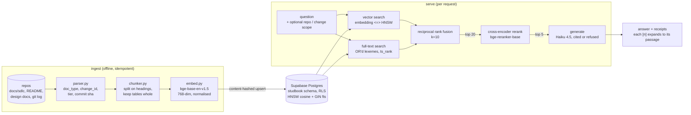

# M5: the service and the page

Date: 2026-09-16. FastAPI, one static page, no build step.

> **Superseded as the primary interface, 2026-09-17.** Paddock's Studbook tab runs this query
> path in its own process — no Python, no service, no port — and adds a thread and streaming
> answers ([paddock-gate.md](paddock-gate.md)). This service is now what you use *without*
> Paddock: the CLI talks to the same code directly, and the HTTP routes remain for a browser or
> anything else that can make a request. Nothing here was deleted or rewritten to make room for
> it; the two share the store and are held to the same numbers by the gates.

## Architecture

## The service

| Route | Auth | Cost per call | What it does |
|---|---|---|---|
| `GET /healthz` | open | free | corpus counts, generator model, which models are loaded |
| `GET /repos` | **key** | free | repos and their change ids -- what the scope filter offers |
| `GET /search?q=` | **key** | free (local models only) | retrieval only: the numbered passages `/ask` would be given |
| `POST /ask` | **key** | ~½ cent | retrieval + a cited answer, with the passages it used |
| `GET /` | open | free | the page (a static shell; it can fetch nothing until a key is entered) |

**Auth (added 2026-09-16).** The three data routes require `Authorization: Bearer <STUDBOOK_API_KEY>`.
The corpus holds client-shaped material and named people, so the routes are never served open:
the server **refuses to start** without a key of at least 32 characters, rather than falling back
to no auth -- a failure that is silent and consequential is the one shape the security baseline
forbids. The comparison is constant-time (`secrets.compare_digest`), and a missing header, a wrong
scheme and a wrong key all get the same 401 with a `WWW-Authenticate: Bearer` challenge, so a
response never says which it was. The key is checked before the request body is validated, so an
unauthenticated caller cannot learn the schema from 422s. The page keeps the key in
`sessionStorage` -- gone when the tab closes, never persisted -- and sends it on every fetch.
Deny-side tests come first in `tests/test_api.py`: every data route 401s without a key, and the
startup refusal is asserted as a raise, not as "no error".

Both models load once at startup and are reused; loading per request would dominate latency
(several seconds each). The database connection is per request instead -- cheap next to the model
work, and a long-lived connection through Supabase's pooler is the thing most likely to go stale
between requests.

`/search` exists as its own route because retrieval is genuinely useful without generation, and
it costs nothing per call: it is the cheap way to see what the model would have been given, which
is also the fastest way to tell a retrieval failure from a generation one.

## The page

One HTML file, no build step, no framework. What it does that matters:

- **Citations are the point, not a footnote.** The model writes `[1]`, `[2]`; the page renders
  each as a clickable chip that opens that exact passage inline, scrolled into view. Answer text
  is inserted as text nodes and the chips are built as elements, so a model response can never
  inject markup into the page.
- **A refusal looks different from an answer** -- its own badge and a coloured rule -- and still
  lists the passages that *were* retrieved, so "not in the record" is checkable rather than
  something you have to take on faith.
- **The scope filter is M4's finding made actionable.** Several questions say "this change"
  without naming it, the corpus holds two near-identical sibling changes, and the model correctly
  refuses because nothing disambiguates them. A repo/change filter resolves what a bare question
  string cannot (`Scope` in `retrieve/hybrid.py`, threaded through both retrievers).

## Verified

- 11 API tests (`tests/test_api.py`), including that a repo scope filter actually restricts
  results and that an unmatched scope returns nothing rather than silently ignoring the filter.
  `/ask` is deliberately not exercised there -- it costs money per call, and generation has its
  own tests.
- End to end in a browser against the live store: a cited answer (clicking `[2]` expanded the
  exact commit message backing the claim) and a refusal ("Which Datadog dashboard watches the
  /health endpoint uptime?" -> *not in the record*, with the retrieved passages still listed).

## Open items

- ~~No auth.~~ Closed 2026-09-16: bearer-token auth on every data route, see "Auth" above. What
  it is not: per-user identity, rate limiting, or an audit log of who asked what. One shared key
  is right for a single operator on localhost; anything with more than one caller needs all
  three, and the eval_runs table is the model for an append-only log of them.
- `/ask` is synchronous and takes a few seconds (embed, rerank, generate). **Both of the items
  that were here are now done in Paddock's tab rather than in this page**, which is where the
  interface work went: the answer streams as it is written, and the tab keeps a thread, so a
  follow-up can say "it" or "that change" -- the other half of the ambiguity the scope filter
  only half-resolves. Neither was ported back to this page: it exists for use without Paddock,
  and a second implementation of a thread is a second thing to keep honest.
- Streaming taught something the page would have taught too, had it been measured: first text
  arrived 12.2s into a 14.3s answer. Generation is not the slow part -- embedding the query and
  reranking twenty passages on CPU is -- so streaming makes the last 15% of the wait visible and
  no more. The lever is the rerank, and [retrieval-ceiling.md](retrieval-ceiling.md) already has
  evidence a pool of 10 scores as well as 20; that is a measured change owing a new baseline,
  not a latency tweak.
